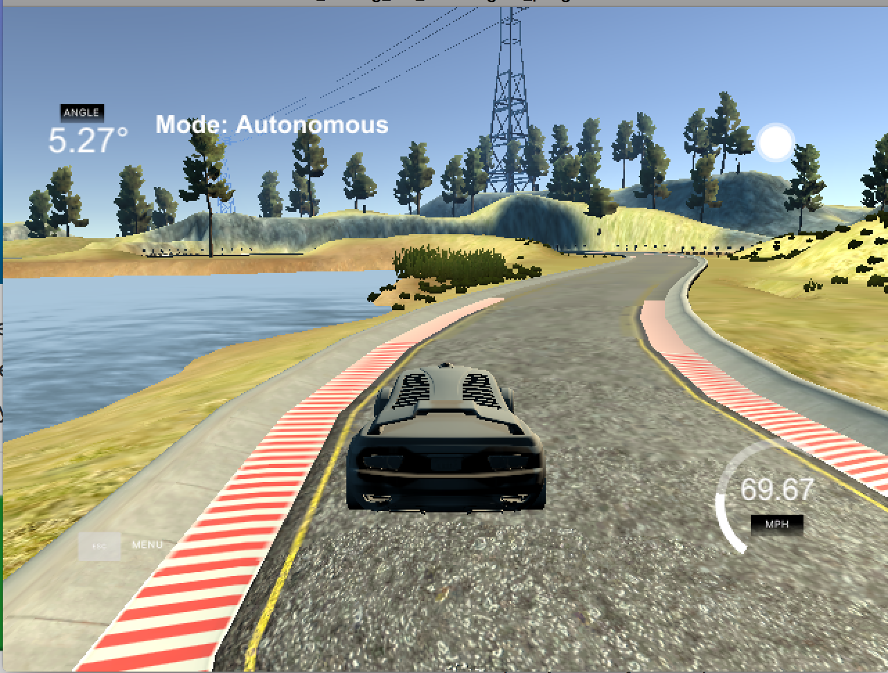

# CarND-Controls-PID
Self-Driving Car Engineer Nanodegree Program

---

## Dependencies

* cmake >= 3.5
 * All OSes: [click here for installation instructions](https://cmake.org/install/)
* make >= 4.1(mac, linux), 3.81(Windows)
  * Linux: make is installed by default on most Linux distros
  * Mac: [install Xcode command line tools to get make](https://developer.apple.com/xcode/features/)
  * Windows: [Click here for installation instructions](http://gnuwin32.sourceforge.net/packages/make.htm)
* gcc/g++ >= 5.4
  * Linux: gcc / g++ is installed by default on most Linux distros
  * Mac: same deal as make - [install Xcode command line tools]((https://developer.apple.com/xcode/features/)
  * Windows: recommend using [MinGW](http://www.mingw.org/)
* [uWebSockets](https://github.com/uWebSockets/uWebSockets)
  * Run either `./install-mac.sh` or `./install-ubuntu.sh`.
  * If you install from source, checkout to commit `e94b6e1`, i.e.
    ```
    git clone https://github.com/uWebSockets/uWebSockets 
    cd uWebSockets
    git checkout e94b6e1
    ```
    Some function signatures have changed in v0.14.x. See [this PR](https://github.com/udacity/CarND-MPC-Project/pull/3) for more details.
* Simulator. You can download these from the [project intro page](https://github.com/udacity/self-driving-car-sim/releases) in the classroom.

There's an experimental patch for windows in this [PR](https://github.com/udacity/CarND-PID-Control-Project/pull/3)

## Basic Build Instructions

1. Clone this repo.
2. Make a build directory: `mkdir build && cd build`
3. Compile: `cmake .. && make`
4. Run it: `./pid`. 

# [Rubric](https://review.udacity.com/#!/rubrics/824/view) points

## Compilation

### Your code should compile.

The code compiles without errors with cmake and make as described in Basic Build Instructions.

## Implementation

### The PID procedure follows what was taught in the lessons.

The base PID algorithm follows what's presented in the lessons. The only difference is adding a [limiter](./src/PID.cpp#L27) to the integral part to prevent the controller windup.

## Reflection

### Describe the effect each of the P, I, D components had in your implementation.

### Describe how the final hyperparameters were chosen.

There are two controllers that work together - the velocity and steering controllers. Tuning the velocity controller was the easiest task. I started with proportional part only reaching a satisfactory speed control with a static offset. Then I moved on to the differential part to reach a satisfactory behaviour in particular for braking. The last step was adding the integral part to compensate for the static offset.

The steering controller was tricky to tune especially for high speed. The submitted code works well for velocities in range 60 - 70 MPH and is sharply tuned. For lower velocities a different set of parameters is prefered to achieve a smooth motion.
The steering controller hyperparameters were selected by hand following a simple approach:

1. Tune the `P` part to have a satisfactory steering with a slight oscillation. Reduce the `P` part slightly after finding the `P` paramter around the oscillation point.
2. Increase the `D` part till the car is capable of dealing with sharp turns without leaving the road.
3. Add integral part to smoothen the steering and to be able to handle long curves. Integral part was in this case the most challenging part which required finding not only the `I` coefficient but also a proper integral limit. Having a large integral limit with a low `I` coefficient would introduce oscillations. Reducing the limit but increasing the `I` coefficient helped to achive the desirable result.



## Simulation

### The vehicle must successfully drive a lap around the track.

Unfortunately simulator recording didn't work for me, so I had to perform a screen recording which introduced some lags into the performance.


